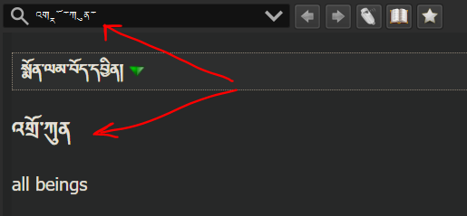

You're having trouble with GoldenDict? We might have the solution right there.

## Tibetan vowels all mixed up

Uncheck `Ignore diacritics when searching` in `Settings > Advanced`

## Complex characters all messed up

If that happens to you, open the Settings and under the frame "Appearance" change "Interface font" to be a font that supports complex characters fully. Personally I use "DDC Uchen" not only as "Interface font" but for all "Safety fonts" as well.

:::tip
The Google "Noto" font is supposed to handle every single language without issues.
:::
